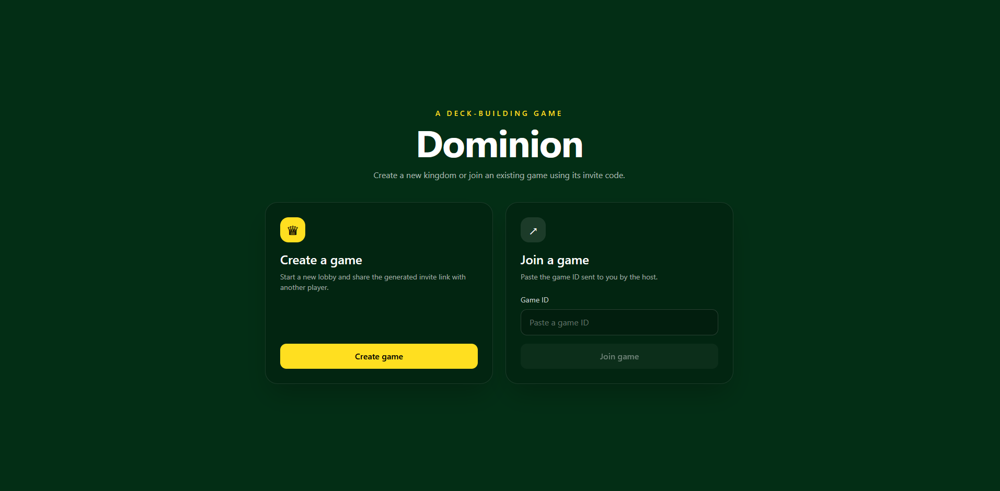

# Dominion Online

> An unofficial multiplayer implementation of the Dominion deck-building game built with **ASP.NET Core**, **React**, and **SignalR**.



---

## Features

- 🎮 Multiplayer gameplay with shareable lobby links
- ⚡ Real-time game synchronization using SignalR
- 🔒 Private player state (players only see their own hand)
- 👀 Spectator-ready architecture with public/private DTO mapping
- 🃏 Deck-building mechanics based on Dominion
- 🏗️ Separation between game engine, API, and frontend
- 📱 Responsive React interface

---

## Tech Stack

### Backend

- ASP.NET Core
- C#
- SignalR
- REST API

### Frontend

- React
- TypeScript
- Vite
- Tailwind CSS

---

## Architecture

```
React Client
      │
      ▼
 ASP.NET Core API
      │
      ▼
 Game Engine
      │
      ▼
 In-memory Game State
```

### Project Structure

```
Frontend
    │
    ├── React Components
    ├── Game Pages
    └── API Client

Backend
    │
    ├── Controllers
    ├── SignalR Hub
    ├── DTO Mapping
    ├── Game Engine
    ├── Card Definitions
    └── Game Logic
```


## Running Locally

### Backend

```bash
dotnet run
```

### Frontend

```bash
cd Dominion.Client
npm install
npm run dev
```

Open multiple browser windows to test multiplayer functionality.

---

## Future Improvements

- Additional Dominion expansions
- AI opponents
- Persistent game storage
- Player accounts
- Replays
- Spectator mode
- Lobby chat
- Undo support
- Docker deployment

---

## Disclaimer

This project is an **unofficial fan project** created for educational and portfolio purposes.

Dominion is a trademark of Rio Grande Games. This project is **not affiliated with, endorsed by, or sponsored by Rio Grande Games**.

No commercial use is intended.
